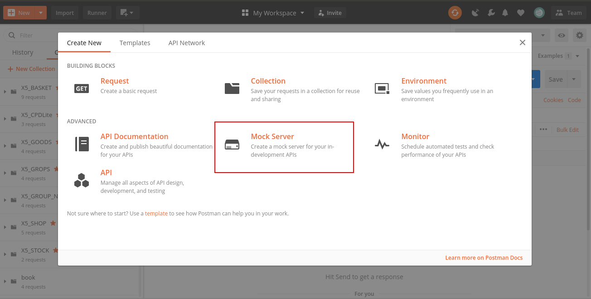
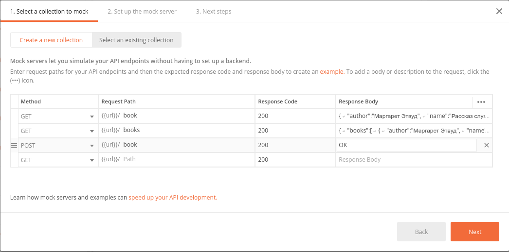
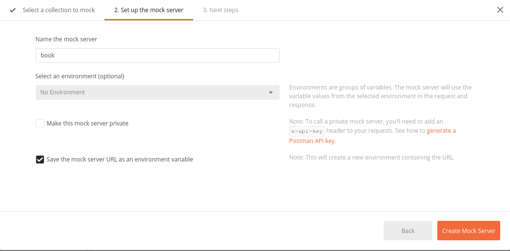
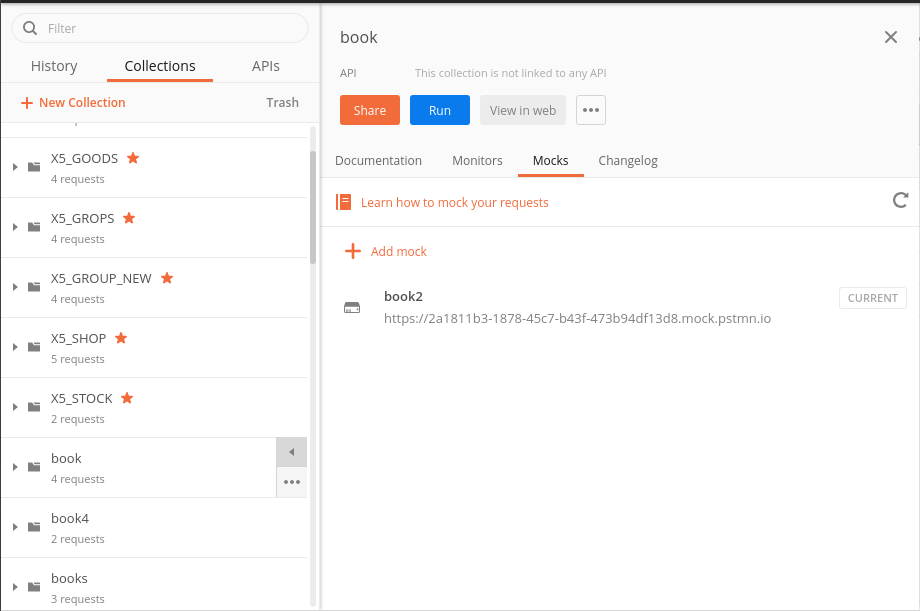
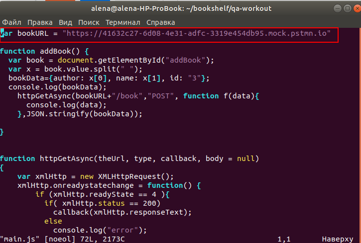

# qa-workout
Тренировка Mock Postman:
1. Зайдите в папку qa-workout
2. Открыть постман и создать новый mock

3. Заполнить коллекцию для mock (приложены json файлы)

4. Скопировать ссылку на mock и записать ее в файл main.js

5. Запустите клиентскую часть:
python3 -m http.server 8080
6. Открыть ссылку в браузере
http://127.0.0.1:8080/index.html
7. Проверить что получается искать и добовлять объекты
